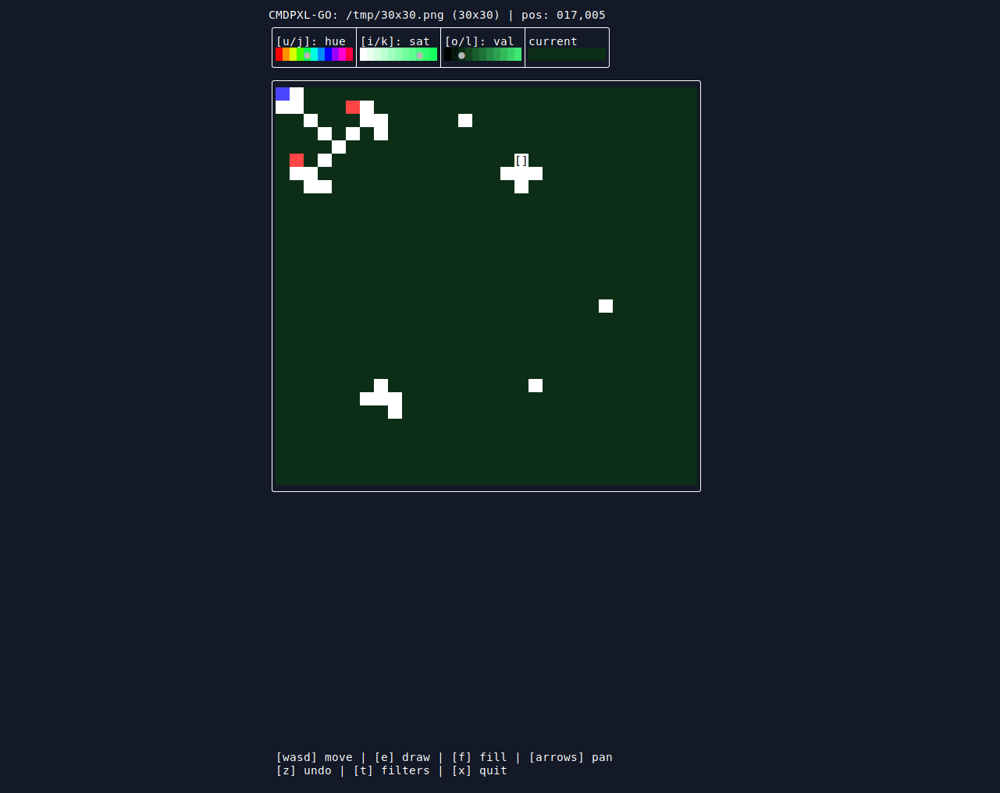
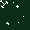

# cmdpxl-go

Go port of the terminal image editor [cmdpxl](https://github.com/knosmos/cmdpxl)

## TODO

* [x] Panning
* [x] ~Better layout management
* [x] ~Fill
* [X] ~Save
* [ ] Pick color
* [ ] Continuous draw
* [ ] Undo fill
* [ ] Layers
* [ ] Filters
